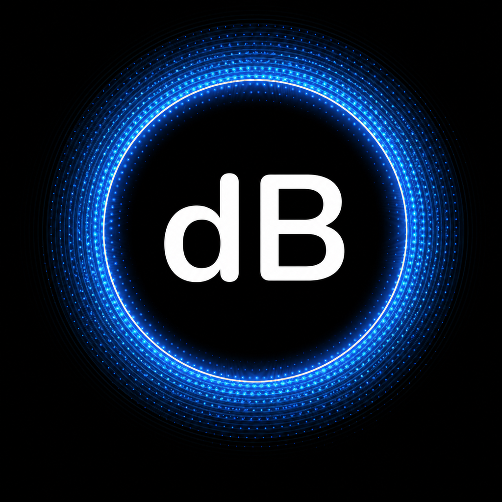

# Decibel Meter for iPhone

A privacy-first SwiftUI sound level meter that estimates environmental volume from the iPhone microphone.

## Features

- Live estimated sound level with peak and running average
- Clear low, moderate, high, and very high level bands
- Recent-level chart during each measurement
- Local measurement history with detail views and swipe-to-delete
- Adjustable calibration offset for comparison with a known meter
- No accounts, analytics, networking, audio recording, or audio-file storage
- VoiceOver labels, Dynamic Type, dark mode, and reduced-motion-friendly native controls

## Requirements

- Xcode 16 or newer
- iOS 17 or newer
- A physical iPhone for microphone measurements

## Run

1. Open `DecibelMeter.xcodeproj` in Xcode.
2. Select the `DecibelMeter` scheme and an iPhone.
3. Choose your development team if Xcode asks for signing.
4. Run the app and allow microphone access.

The iOS Simulator can build and display the interface, but meaningful sound readings require a physical device.

## Accuracy

Phone microphones and automatic gain behavior vary by model and environment. This app converts microphone amplitude into an estimated sound-pressure level using a reference offset, then applies the calibration value from Settings. Compare it with a trusted sound meter and adjust the offset before relying on readings. It is not a certified instrument and should not be used for occupational, medical, or legal decisions.

## Privacy

Microphone samples are analyzed in memory and immediately discarded. Only session summaries (date, duration, minimum, average, and peak levels) are stored locally with SwiftData. The app does not connect to the internet.

## Project structure

- `App/` — tab and navigation shell
- `Features/` — meter, history, and settings screens
- `Models/` — SwiftData measurement history
- `Services/` — microphone capture and sound-level calculation
- `Shared/` — formatting helpers
- `Supporting/` — app metadata, assets, and privacy manifest
- `Artwork/` — production app-icon master artwork
- `DecibelMeterTests/` — calculation and classification unit tests

## License

MIT
